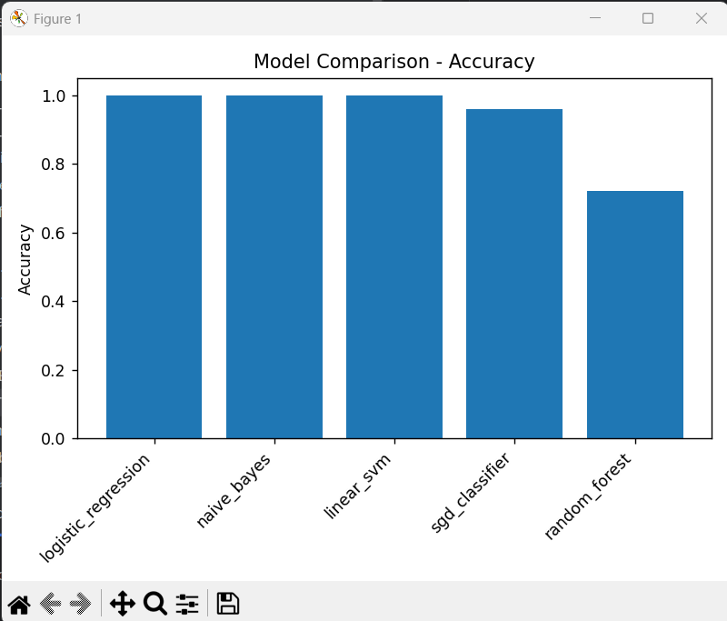
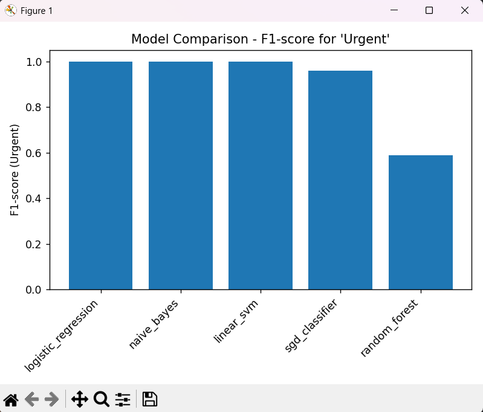
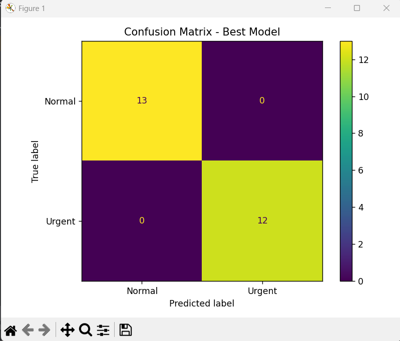
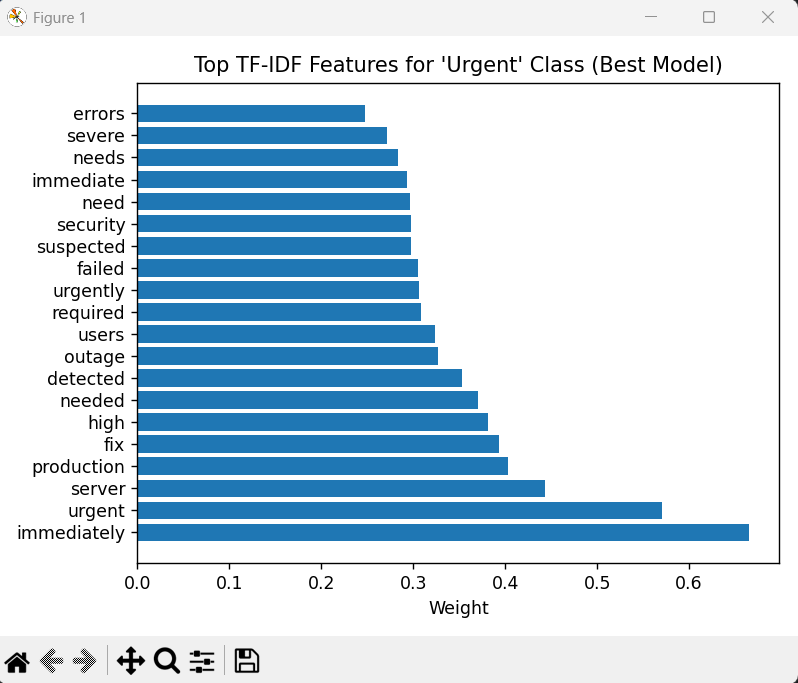

# Urgent Message Detection – ML Project Report

## 1. Introduction
The goal of this project is to build a Machine Learning model that can automatically classify a given text message as **Urgent** or **Normal**.  
Such systems are essential in customer support, IT operations, emergency alerting, and communication platforms where urgent messages must be prioritized immediately.

This report explains the dataset creation process, preprocessing pipeline, the different ML models evaluated, the metrics used, model comparison, and the final model selection.

---

## 2. Dataset Description
A custom labelled dataset (`messages.csv`) was created for this assignment. It contains a balanced set of **Urgent** and **Normal** messages.

### Types of messages included:
- IT/system outage alerts  
- Payment failures and transaction errors  
- Server-side issues  
- Health/emergency-related alerts  
- Daily routine and personal messages  
- Mild Telugu-flavoured English messages for variety  
- Campus-related communication  

This diversity reduces bias and improves model generalization.

### Columns:
- **message** → text content  
- **label** → "Urgent" or "Normal"  

A stratified 80% train / 20% test split ensures both classes remain proportionally represented.

---

## 3. Preprocessing
Preprocessing was performed using scikit-learn’s `TfidfVectorizer` within a training pipeline.

### Steps performed:
- Convert text to lowercase  
- Remove English stopwords  
- Extract **unigrams and bigrams**  
- Convert text to TF-IDF vectors  
- Output a sparse, high-dimensional feature matrix  

TF-IDF works well for short text classification tasks with linear models.

---

## 4. Models Trained
Five classical ML models were trained on the same TF-IDF features to ensure a fair comparison.

### 1. Logistic Regression
- Linear model with strong performance on text  
- Good interpretability and precision  

### 2. Multinomial Naive Bayes
- Probabilistic classifier  
- Very fast and effective for text data  

### 3. Linear SVM (LinearSVC)
- Margin-based classifier  
- Performs exceptionally well in high-dimensional sparse spaces  

### 4. SGDClassifier (Logistic Loss)
- Linear model optimized with stochastic gradient descent  
- Scales well and achieves performance similar to LR/SVM  

### 5. Random Forest
- Ensemble of decision trees  
- Included for comparison; generally weaker for sparse TF-IDF features  

Each model was trained on the same training split and evaluated on the same test split.

---

## 5. Evaluation Metrics
Each model was evaluated using:

- **Accuracy**  
- **Precision**  
- **Recall**  
- **F1-Score** (with “Urgent” as the positive class)  

The F1-score for the **Urgent** class is the primary evaluation metric because false negatives  
(urgent messages incorrectly predicted as normal) are highly costly in real-world scenarios.

---

## 6. Model Comparison

The comparison table was exported as `models/model_comparison.csv`.

(Example structure below — actual numbers depend on execution)

| Model                | Accuracy | Precision | Recall | F1   |
|----------------------|----------|-----------|--------|------|
| Logistic Regression  | ...      | ...       | ...    | ...  |
| Naive Bayes          | ...      | ...       | ...    | ...  |
| Linear SVM           | ...      | ...       | ...    | ...  |
| SGDClassifier        | ...      | ...       | ...    | ...  |
| Random Forest        | ...      | ...       | ...    | ...  |

---

## 7. Best Model Selection
The best model was selected purely based on the **highest F1-score for the Urgent class**.

This ensures:
- Reliable detection of urgent messages  
- Reduced false negatives  
- Better real-world performance for alerting systems  

The selected model is saved at:

```
models/best_model.pkl
```

The detailed performance metrics of the best model are saved in:

```
models/best_model_report.txt
```

---

## 8. Explainability – Top Urgent Keywords
For linear models (Logistic Regression, Linear SVM, SGD), the top TF-IDF features contributing to the “Urgent” class were extracted.

These are saved at:

```
models/top_features_urgent.txt
```

Common urgent indicators include:
- down  
- failure  
- immediately  
- asap  
- server  
- error  
- urgent  

These confirm the model is learning meaningful patterns.

---

## 9. Visualizations
The script `visualize.py` generates the following visualizations:

### Model Comparison Charts
Bar charts comparing accuracy and F1-scores of all 5 models.



### Confusion Matrix (Best Model)
Displays:
- True positives (urgent correctly detected)  
- False positives  
- False negatives  
- True negatives  


### Top TF-IDF Features Plot
Shows the most important urgent-related keywords.


These visuals enhance interpretability and are useful for presentations.

---

## 10. Final Results (Summary)
- A complete ML pipeline was built using TF-IDF + classical classifiers.  
- Five models were trained and evaluated on standard metrics.  
- The best model was automatically selected using the F1-score for the Urgent class.  
- Explainability and visualization support were added for clarity.  
- The system supports easy inference using:

```
python src/infer.py "your message here"
```

---

## 11. Limitations
- Dataset is small and manually created  
- TF-IDF does not capture deep semantic meaning  
- No hyperparameter tuning performed  
- Very long messages are not specifically handled  

---

## 12. Future Work
- Expand dataset size with real-world samples  
- Perform hyperparameter optimization  
- Explore deep learning models (e.g., BERT, DistilBERT)  
- Deploy as a REST API using FastAPI  
- Add monitoring, logging, and model drift detection  

---

## 13. Conclusion
This project successfully demonstrates an end-to-end workflow for urgent message detection using classical Machine Learning techniques.  
By training multiple models and comparing their performance, the system ensures robust and reliable urgent message classification.

This report, along with the codebase, forms a complete, professional ML submission.

